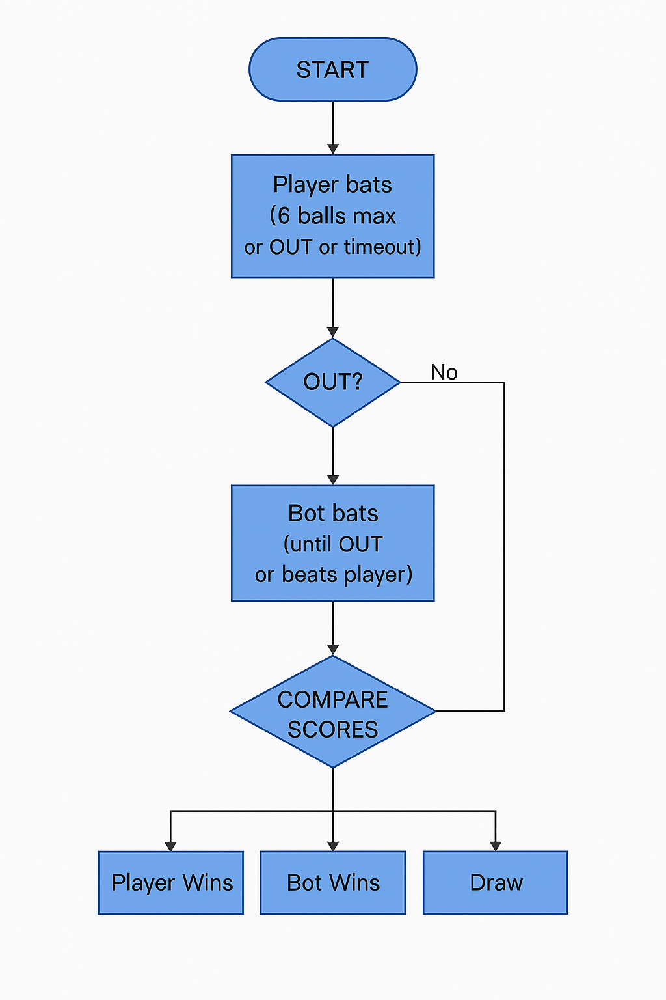
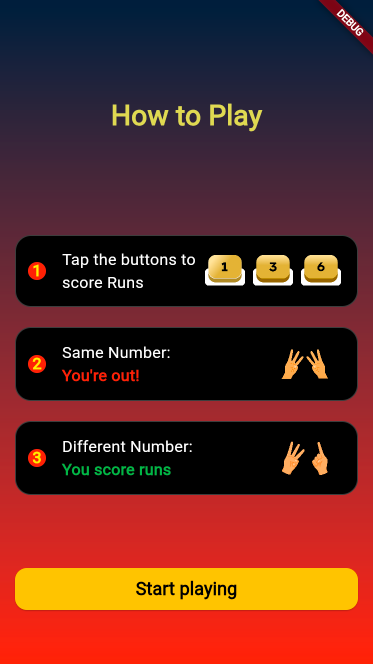
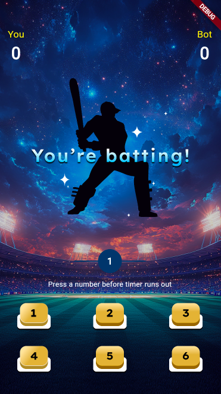
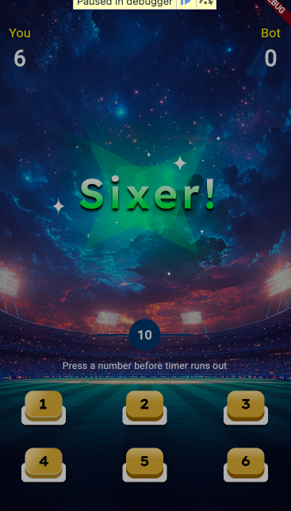
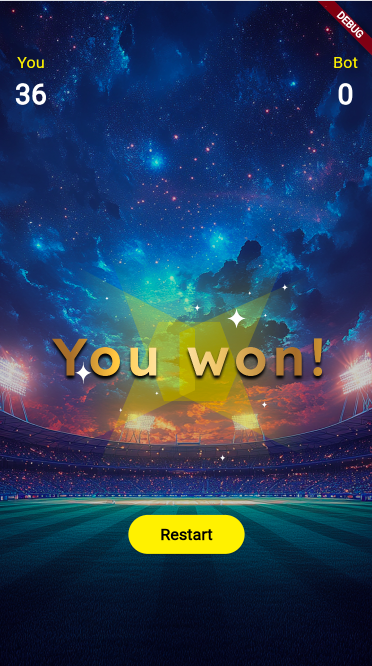
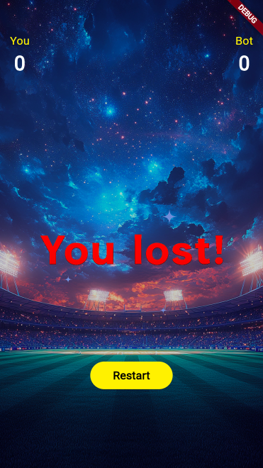
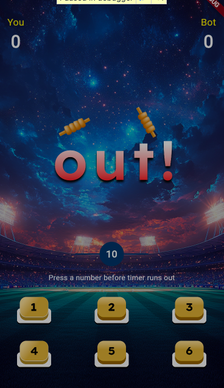

# Hand Cricket Game

A Flutter-based implementation of the popular Hand Cricket game where players can play against the computer.

## Features

- Single player mode against Computer
- Batting and bowling mechanics
- Score tracking
- Interactive UI
- Game statistics

## Getting Started

1. Clone the repository
2. Download `flutter 3.29.2`
2. Run `flutter pub get` to install dependencies
3. Run `flutter run` to start the app

## Development

* Clean Architecture implementation:
  - **Presentation Layer**: Flutter UI widgets, screens, and controllers
  - **Domain Layer**: Game logic, entities, and Game state management using ScopedModel
* ScoopedModel Used for state management
* Flutter default navigation
* Flow Chart
 

## Screenshots

  
  
  

  
  
  

